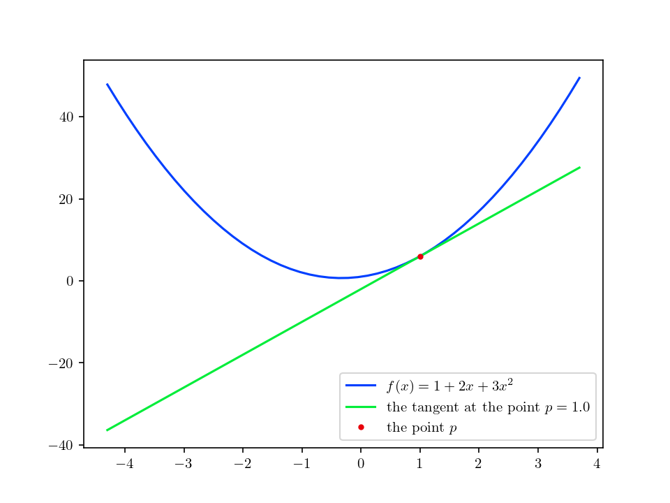
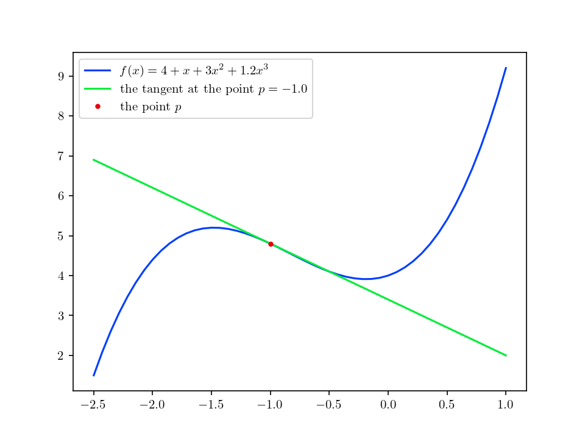

# 2021 Training Courses

## Q1

Deadline: 2021-08-13

1. 設計一個多項式函數類別 `Polynomial` 和變數類別 `Variable`，支援以下功能：
    - 計算多項式函數
    - 對多項式函數進行微分
2. 實作 `plot_polynomial(file, function, p_x, x, formula)`，輸出一張 png 檔：
    - 畫出多項式函數圖形
    - 給定一個點，畫出經過該點的多項式函數的切線
    - 參數：
        - `file`: 輸出的檔案名稱
        - `function`: 多項式函數的 instance
        - `p_x`: 點坐標
        - `x`: 圖表的 x 軸
        - `formula`: 數學式描述

### Packages

- NumPy
- Matplotlib
- pytest

### Prototype

In `libs/functional.py`:

```python
from typing import List, Union

import numpy as np


class Variable:

    def __init__(self, value=None):
        self.value = value
        self.grad = None


class Polynomial:

    def __init__(self, a: List = None):
        self.a = np.array(a)

    def __call__(self, x: Union[float, np.ndarray]) -> Variable:
        pass
```

In `libs/visualization.py`:

```python
from pathlib import Path

import numpy as np

from libs.functional import Polynomial
from libs.visualization import plot_polynomial


class TestPlotPolynomial:

    def test_plot_polynomial_1(self):
        f = Polynomial(a=[1., 2., 3.])  # 1 + 2x + 3x^2
        file = Path('test_plot_polynomial_1.png')
        x = np.linspace(-4.3, 3.7)
        plot_polynomial(file=file, function=f, p_x=1., x=x, formula='1 + 2x + 3x^2')
        assert file.exists()

    def test_plot_polynomial_2(self):
        f = Polynomial(a=[4., 1., 3., 1.2])  # 4 + x + 3x^2 + 1.2x^3
        file = Path('test_plot_polynomial_2.png')
        x = np.linspace(-2.5, 1.0)
        plot_polynomial(file=file, function=f, p_x=-1., x=x, formula='4 + x + 3x^2 + 1.2x^3')
        assert file.exists()
```

### Test Cases

In `tests/test_functional.py`:

```python
import numpy as np

from libs.functional import Polynomial


class TestPolynomial:

    def test_io(self):
        f = Polynomial(a=[1., 2., 3.])  # 1 + 2x + 3x^2
        assert f(4.).value == 57.
        assert f(5.).value == 86.

    def test_io_array(self):
        f = Polynomial(a=[1., 2., 3.])  # 1 + 2x + 3x^2
        x = np.array([4., 5.])
        y = np.array([57., 86.])
        assert np.all(f(x).value == y)

    def test_grad(self):
        f = Polynomial(a=[1., 2., 3.])  # 1 + 2x + 3x^2
        # gradient: <2 + 6x>
        assert f(4.).grad == 26.
        assert f(5.).grad == 32.
```

In `tests/visualization.py`:

```python

from pathlib import Path

import numpy as np

from libs.functional import Polynomial
from libs.visualization import plot_polynomial


class TestPlotPolynomial:

    def test_plot_polynomial_1(self):
        f = Polynomial(a=[1., 2., 3.])  # 1 + 2x + 3x^2
        file = Path('test_plot_polynomial_1.png')
        x = np.linspace(-4.3, 3.7)
        plot_polynomial(file=file, function=f, p_x=1., x=x, formula='1 + 2x + 3x^2')
        assert file.exists()

    def test_plot_polynomial_2(self):
        f = Polynomial(a=[4., 1., 3., 1.2])  # 4 + x + 3x^2 + 1.2x^3
        file = Path('test_plot_polynomial_2.png')
        x = np.linspace(-2.5, 1.0)
        plot_polynomial(file=file, function=f, p_x=-1., x=x, formula='4 + x + 3x^2 + 1.2x^3')
        assert file.exists()
```

`test_plot_polynomial_1.png`:



`test_plot_polynomial_2.png`:


